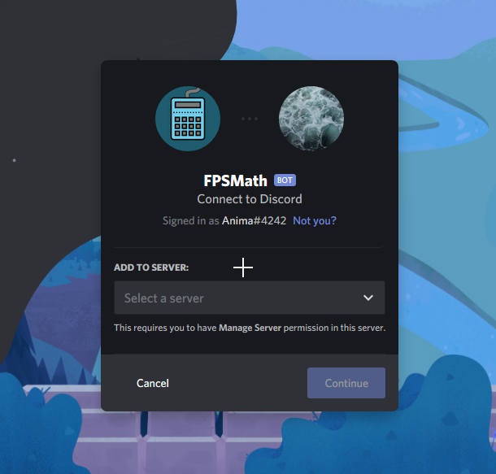
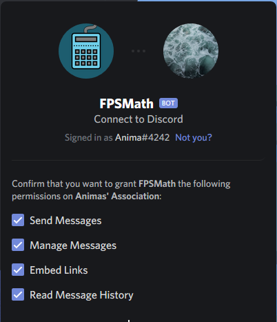

:::caution IMPORTANT
You must have the Manage Server or Administrator permission to add a bot to a server.
:::

## Steps to Invite

Just 4 easy steps away from converting in your own server. Let's go!

### 1. Click the Link

[**THE LINK**](/invite)

\(Login to Discord if you're not already logged in.\)

### 2. Select a Server

### 3. Choose Default Permissions

### 4. Authorize

And you're done! its that simple, now on to using it.
